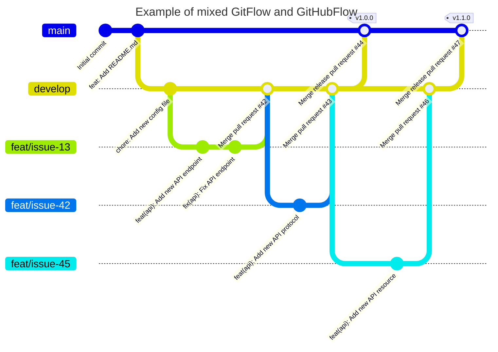

# Commit convention and workflow for repository

## Getting started

### Before commit

Before implementing a new feature or fixing a bug, create a new issue in the repository. 

If the issue already exists, assign yourself to it.

Issue should be clear and concise, and should contain all the information needed to implement the feature or fix the bug.

### Start working on a new feature or bug fix

After creating a new issue or assigning yourself to an existing issue, create a new branch from the `develop` branch.

The name of the branch should be `feat/issue-<issue number>` or `fix/issue-<issue number>` e.g. `feat/issue-13` or `fix/issue-42`.

If its another type of change, use the following naming convention: `<type>/issue-<issue number>` e.g. `chore/issue-13` or `refactor/issue-42`.

Types of changes are similar to [Conventional Commits](https://www.conventionalcommits.org/en/v1.0.0-beta.4/).

Of course once you have created a branch, you need checkout to it before you start working.

### Commit message

After you have finished implementing a new feature or fixing a bug, you need to commit your changes.

Also, sometimes it's better to commit multiple times, for one feature or bug fix, instead of one enormous commit.

Write commit message according to [Conventional Commits](https://www.conventionalcommits.org/en/v1.0.0-beta.4/).

Examples of commit message:

```text
feat: Add new search API endpoint for users
```

```text
fix(api): Prevent user from searching for himself

Changes search API endpoint to prevent user from searching for himself by adding exclude filter to the query.
```

```text
feat(api)!: Merge all search API endpoints into one

Due to the fact that all search API endpoints are very similar, they are merged into one.
Selected endpoint is determined by the type of the query parameter passed to the endpoint.

BREAKING CHANGE: Due to the fact that all search API endpoints are merged into one, all previous search API endpoints are removed.
```

### Pushing to remote repository

After you have finished implementing a new feature or fixing a bug, you need to push your changes to the remote repository.

Since you have created a new branch, you need to push it to the remote repository.

### Pull request

After you have pushed your changes to the remote repository, you need to create a pull request from your branch to the `develop` branch.

Pull request should contain all the information needed to review and approve the changes.

Also, link related issue to the pull request by adding `Closes #<issue number>` to the pull request description e.g. `Closes #13`.

If the pull request is related to multiple issues, add `Closes #<issue number>` for each issue.

If the pull request is related to multiple issues, but not all of them are closed by the pull request, add `Refs #<issue number>` for each issue and provide explanation in the pull request description.

After creating a pull request, assign reviewers to it and wait for review and approval.

### Review and approval

After you have created a pull request, reviewers will review your changes and approve them if everything is ok.

If reviewers find some issues, you need to fix them and push the changes to the remote repository in the same branch e.g. `feat/issue-13`.

Of course if reviewers find some issues, they will add comments to the pull request with explanation of the issues.

### Merge pull request

After reviewers have approved your changes, you can merge your pull request into the `develop` branch.

Also, you can delete your branch after merging it into the `develop` branch.

### Create a release

After some time, when you have implemented a lot of new features and fixed a lot of bugs, you can create a new release.

To create a new release, you need to merge the `develop` branch into the `main` branch.

Of course, you need to create a pull request from the `develop` branch to the `main` branch.

Pull request should contain all the information needed to review and approve the changes.

## Example of workflow

### Diagram of flow



### Notes about diagram

- `develop` branch is protected and can be merged only by pull requests
- `main` branch is protected and can be merged only by pull requests
- `<type>/issue-<issue number>` branches are pushed to the remote repository and pull requests are created from them and merged into `develop` branch after review and approval
- `<type>/issue-<issue number>` after merge into `develop` branch are deleted
- `main` branch is merged into `develop` branch only when a new release is created
- `main` branch is merged into `develop` branch by pull request

## Learn more

To learn more about, take a look at the following resources:
- [Conventional Commits](https://www.conventionalcommits.org/en/v1.0.0-beta.4/)
- [Git Branching Strategies](https://www.abtasty.com/blog/git-branching-strategies/)
- [Learn Git Branching](https://learngitbranching.js.org/)
- [Most useful git commands](https://orga.cat/most-useful-git-commands)
- [Another git commands cheatsheet](https://davidwalsh.name/git-commands)
- [Mermaid (used to create diagrams)](http://mermaid.js.org/intro/)
- [PlantUML (alternative to Mermaid)](https://plantuml.com/)
- [Draw.io (can be used with Mermaid and PlantUML)](https://www.draw.io/)